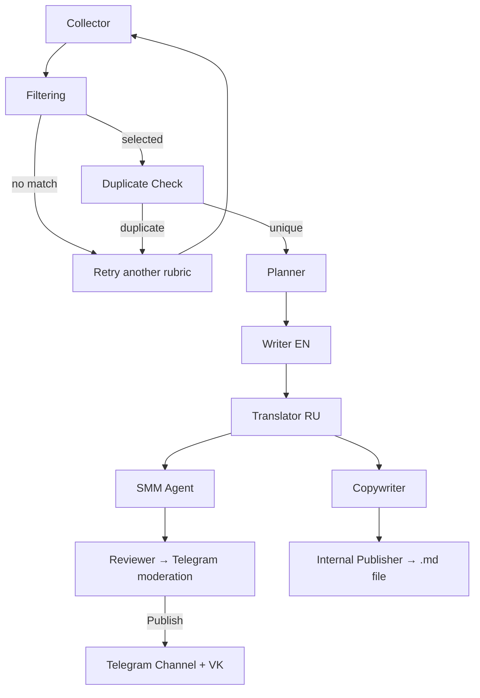

# AI News Bot

A multi-agent bot that collects AI news from RSS feeds, generates social-media posts with an LLM pipeline, and publishes them to Telegram and VK after human approval.

## Features

- **Weighted RSS collection** — picks a rubric at random (Major Releases, Open Source, Deep Dives, etc.) and fetches fresh articles from 30+ curated sources
- **LangGraph pipeline** — orchestrates specialized agents for filtering, planning, writing, translation, and SMM polish
- **Duplicate detection** — ChromaDB + sentence embeddings prevent reposting the same story
- **Human-in-the-loop** — drafts are sent to a Telegram work group with **Publish** / **Reject** buttons
- **Cross-platform publishing** — approved posts go to a Telegram channel and a VK community
- **Long-read generation** — a parallel branch produces an extended article delivered as a `.md` file to the work group
- **Scheduled runs** — cron-based workflow at configurable hours (Moscow time)

## How It Works



1. The **Collector** fetches articles from a randomly selected rubric in `data/ai_rss_sources_master.json`.
2. The **Filtering** agent picks the most newsworthy item using an LLM.
3. **Duplicate check** compares the article against previously processed stories in ChromaDB.
4. **Planner → Writer → Translator** produce a Russian social-media post.
5. Two branches run in parallel:
   - **SMM → Reviewer** — polishes the post and sends it for moderation in Telegram.
   - **Copywriter → Internal Publisher** — generates a long-read article and delivers it as a file.
6. After you click **Publish**, the post is sent to the configured Telegram channel and VK group.

## Tech Stack

| Component | Technology |
|-----------|------------|
| Orchestration | [LangGraph](https://github.com/langchain-ai/langgraph) |
| LLM | OpenAI-compatible API |
| Embeddings | HuggingFace `sentence-transformers` |
| Vector DB | ChromaDB |
| Telegram | aiogram 3 |
| VK | vk_api |
| Scheduler | APScheduler |
| Runtime | Python 3.10+, [uv](https://docs.astral.sh/uv/) |

## Project Structure

```
ai-news-bot/
├── agents/          # LLM agents (collector, writer, SMM, reviewer, …)
├── config/          # Application settings (pydantic-settings)
├── core/            # Models, logging, ChromaDB storage, pending-post state
├── graph/           # LangGraph workflow definition
├── tools/           # RSS parser, embeddings, publication helpers
├── data/            # RSS source catalog (rubrics + feeds)
├── main.py          # Entry point: scheduler + Telegram bot
├── Dockerfile
└── docker-compose.yml
```

## Prerequisites

- Python 3.10 or newer
- [uv](https://docs.astral.sh/uv/getting-started/installation/) (recommended) or pip
- An OpenAI-compatible LLM endpoint (API key + base URL)
- A Telegram bot token, channel, and work group for moderation
- A VK community access token (optional, for VK cross-posting)

## Installation

### Local

```bash
git clone https://github.com/pueraeternis/ai-news-bot.git
cd ai-news-bot

uv sync
```

Create a `.env` file in the project root (see [Configuration](#configuration)).

### Docker

```bash
docker compose up -d --build
```

Persistent data is mounted from `./db`, `./data`, and `./logs`.

## Configuration

Copy the variables below into `.env`. All settings are loaded via `config/settings.py`.

| Variable | Description |
|----------|-------------|
| `OPENAI_API_URL` | Base URL of the OpenAI-compatible API |
| `OPENAI_API_KEY` | API key |
| `LLM_MODEL_NAME` | Model name (e.g. `gpt-4o`) |
| `LLM_TEMPERATURE` | Generation temperature (default: `0.7`) |
| `LLM_MAX_TOKENS` | Max tokens per request (default: `16384`) |
| `TELEGRAM_BOT_TOKEN` | Bot token from [@BotFather](https://t.me/BotFather) |
| `TELEGRAM_CHANNEL_ID` | Target channel ID (e.g. `@my_channel` or `-100…`) |
| `TELEGRAM_WORK_GROUP_ID` | Work group/chat ID for moderation (e.g. `-100…`) |
| `VK_ACCESS_TOKEN` | VK community access token |
| `VK_GROUP_ID` | VK community numeric ID |

Posting schedule defaults to **11, 13, 16, 19, 22 MSK** (`POSTING_HOURS` in `config/settings.py`).

### Telegram setup tips

1. Create a bot via BotFather and add it to your channel (as admin) and work group.
2. Send `/start` to the bot in the work group to confirm the connection.
3. To find the work group ID, run `python tests/test_telegram.py` — it prints the chat ID in the required format.

## Usage

### Daemon mode (scheduler + moderation bot)

Runs the workflow on schedule and listens for Publish/Reject callbacks:

```bash
uv run python main.py start
```

### Manual run (single workflow)

Useful for testing without starting the scheduler:

```bash
uv run python main.py
```

### Docker

```bash
docker compose up -d
docker compose logs -f
```

## RSS Sources

Sources are organized into weighted rubrics in `data/ai_rss_sources_master.json`:

| Rubric | Weight |
|--------|--------|
| Major Releases (Must-Know) | 0.30 |
| Open-Source Pulse (How-To) | 0.20 |
| Deep Dives (Analysis) | 0.15 |
| The Big Picture (Think Pieces) | 0.15 |
| AI Startup of the Week | 0.10 |
| Unexpected Applications | 0.05 |
| Myth Busting / Hype vs. Reality | 0.05 |

Edit this file to add feeds or adjust rubric weights.
